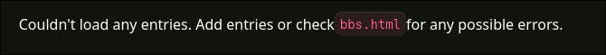

+++
title = "atomlog"
description = "nanolog but smaller"

sort_by = "date"
generate_feeds = true
template = "bbs.html"

extra.accent_color = "purple"
extra.bbs.header = "# atoms"
+++

  

  note from <a href="https://anins1der.is-a.dev">anins1der</a>
  

  I have now brought the [Blog But Smaller](https://anins1der.is-a.dev/bbs) thingy from my website to Retro's, with a change: He will be able to input the date he wrote a entry but won't be able to input a time.
  The reasoning I have is that RetroBloxxer is usualy so bored that even thought this is here with the hopes to *kind of* eliminate the painful boredom of his, I believe that he won't post more than one entry here so indicating the time of a entry is useless in this case.
  Plus; this setup usually depends on a helper script I have that fills the date and time for me, and as far as I know, Retro just can't use either the Git or GitHub's CLI to actually post the resuting output produced from that helper script. He just goes on to edit all the required files one by one, from GitHub's web UI, slowly but surely, without the pain of using a terminal.
  Anyways, I need Retro to do me a favor and edit these quoted text below:

  > As the name suggests, this page holds what's usually referred to as [microblog](https://en.wikipedia.org/wiki/Microblogging)s or [nanolog](https://daudix.one/nanolog)s. A name I wanted to use initially (that being <mark>picoblog</mark>, <small>like nanolog but even smaller</small>) was _kinda_ unoriginal + the fact that it sounded like _that_ made me pick this wonderful(!) name that's obviously better at every way- {{ audio(name="Nuh uh.", url="https://www.myinstants.com//media/sounds/sonic-3-wrong-right.mp3") }}
  > 
  > Anyways, just go on and read these *smol blost*s if you want to.

  Oh and I will leave two example entries below so that this field doesn't say this:
  

